# Demo Java Coffee Shop & Studio Website

This is a demo website for a Java Coffee Shop & Studio, featuring both a frontend and a backend.

- [Backend Ropo](https://github.com/xxxJay123-p/demo_java_web-backend)
- [Backend via render](https://demo-java-web-backend.onrender.com)

- [Live Demo via cloudflare](https://demo-java-web.pages.dev/)
  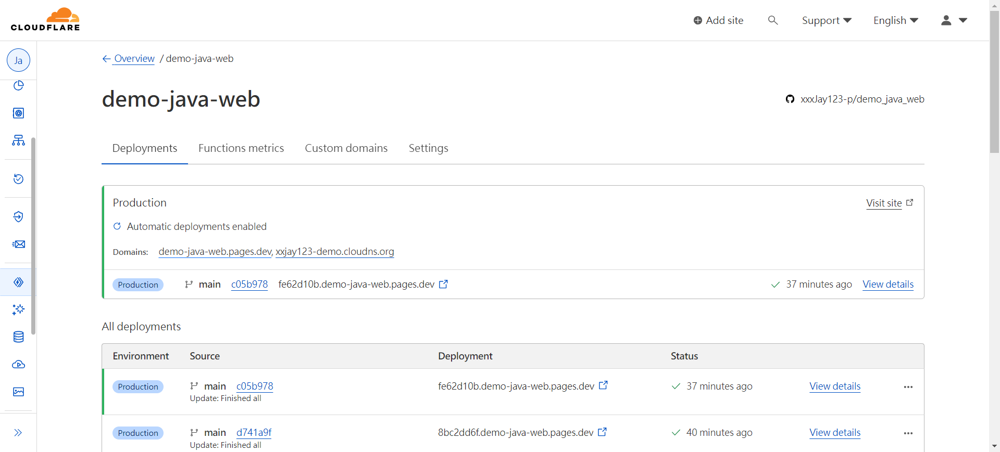

## Frontend

The frontend of the website is built using [Vite](https://vitejs.dev/) and [React](https://reactjs.org/). Vite is a modern frontend build tool that provides fast and lean development experience, while React is a popular JavaScript library for building user interfaces.
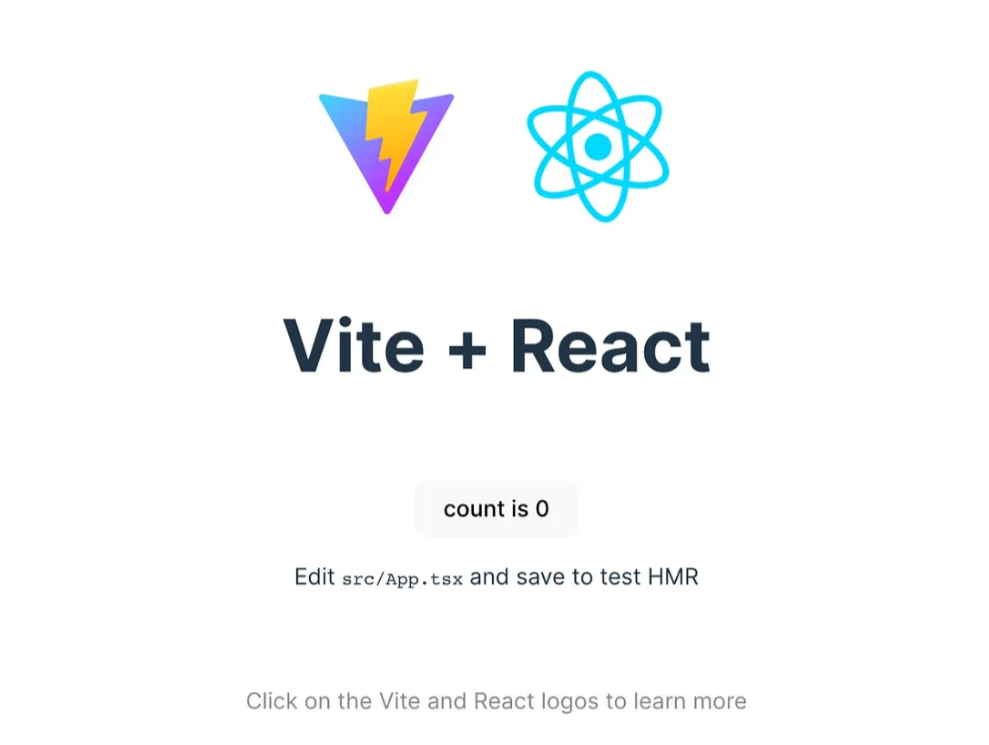

### Getting Started

To get started with the frontend, you'll need to have [Node.js](https://nodejs.org/) installed on your machine. Once you've cloned this repository, navigate to the `frontend` directory and run the following commands:

```bash
npm install
npm start
```

This will start the server and make it available at ` http://localhost:5000`.

## Dependencies

```json
  "dependencies": {
    "@testing-library/jest-dom": "^5.14.1",
    "@testing-library/react": "^11.2.7",
    "@testing-library/user-event": "^12.8.3",
    "@vitejs/plugin-react-refresh": "^1.3.6",
    "aos": "^2.3.4",
    "bootstrap": "^5.3.2",
    "bootstrap-icons": "^1.11.3",
    "jwt-decode": "^3.1.2",
    "react": "^17.0.2",
    "react-bootstrap": "^2.10.0",
    "react-bootstrap-icons": "^1.10.3",
    "react-dom": "^17.0.2",
    "react-icons": "^5.0.1",
    "react-router-dom": "^5.3.4",
    "react-scripts": "4.0.3",
    "react-syntax-highlighter": "^15.5.0",
    "styled-components": "^5.3.1",
    "typewriter-effect": "^2.21.0",
    "video-react": "^0.16.0",
    "web-vitals": "^1.1.2",
    "zustand": "^3.5.10"
  },

    "devDependencies": {
    "@vitejs/plugin-react": "^4.2.1",
    "vite": "^5.0.12"
  }
```

## Vite Config

`vite.config.js`

```js
import { defineConfig } from "vite";
import reactRefresh from "@vitejs/plugin-react-refresh";
import react from "@vitejs/plugin-react";

export default defineConfig(() => {
  return {
    build: {
      outDir: "build",
    },
    plugins: [react(), reactRefresh()],

    server: {
      port: 5000,
    },
  };
});
```

## Router

- path=`/` = **Home** page
  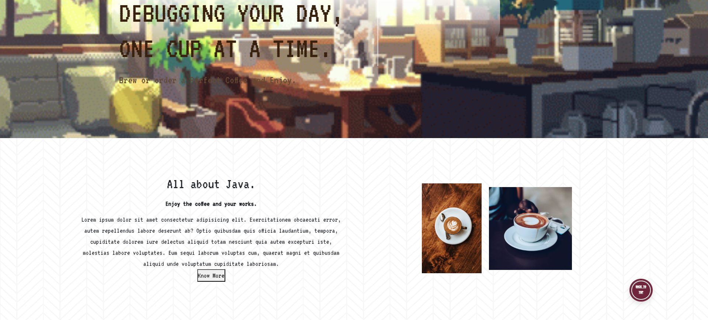

- path=`/login` = **LoginSignup** page
  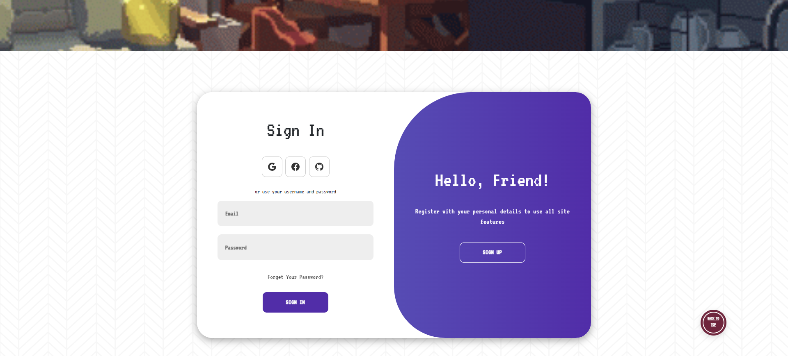

- path=`/order` = **OrderHome** page
  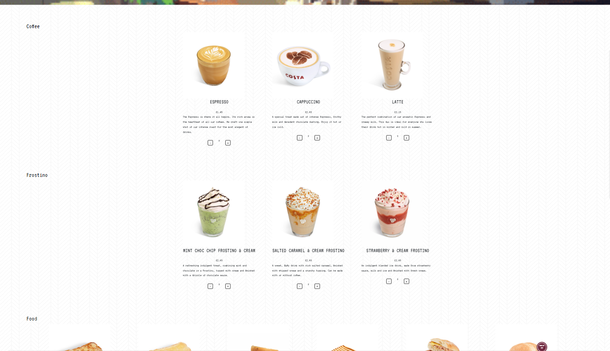

  - path=`/order/${types}`
    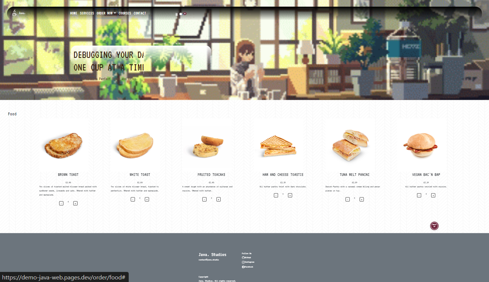

- path=`/course` = **Course** page
  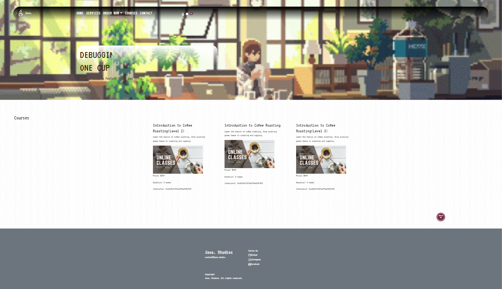

- path=`/contactus` = **Contact us** page
  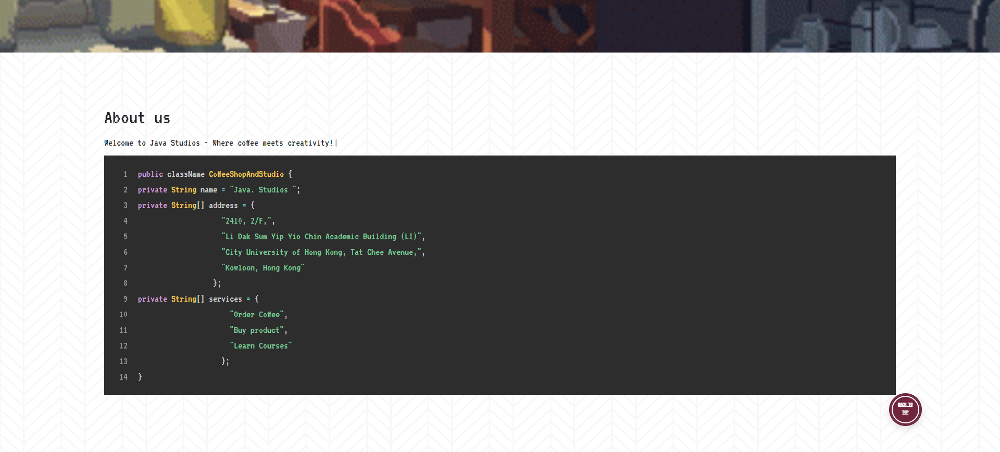

- path=`/cart` = **Cart** page
  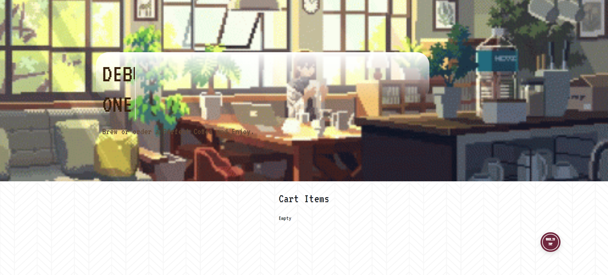
  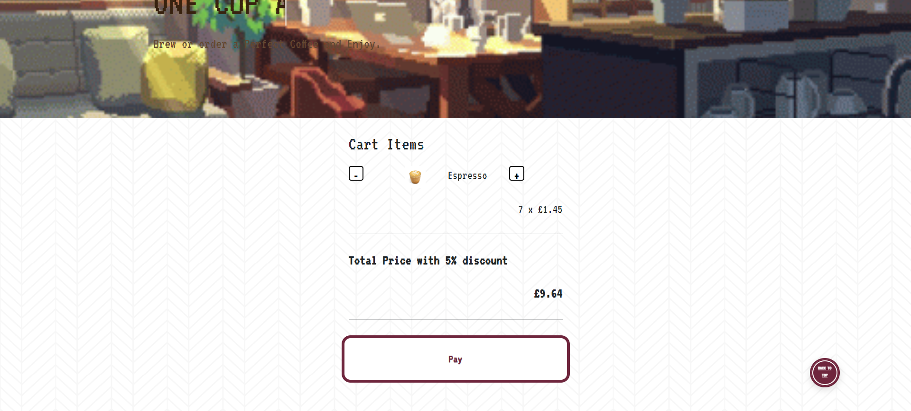
  - path=`/paymentReceived}` =**Payment Receiveds** page
    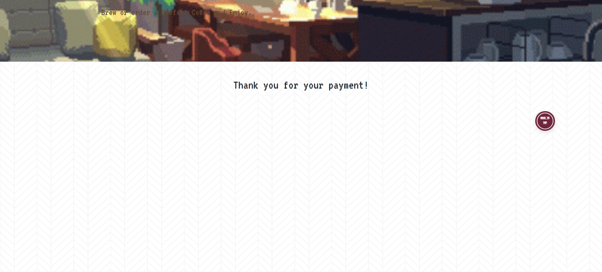

## Contributing

Pull requests are welcome. For major changes, please open an issue first to discuss what you would like to change.
